# CVEhunter V1.0 用户手册

来源：用户手册.pdf

## 一、核心功能构件

## 1、项目文件浏览器

## 2、代码编辑器+终端（监控+Python 代码执行）

## 3、AI 对话/文件审计助手

## 4、SQLmap 彩色验证终端模块+双语MD 报告导出模块

## 二、用户操作手册

## 1、启动指引

使用终端python 运行run_app.py
或者双击start.bat

## 2、前置指引

启动软件后会弹窗提示前置设置，方便后续测试
可以勾选取消显示提醒，也可以一键打开hosts 文件夹进行设置

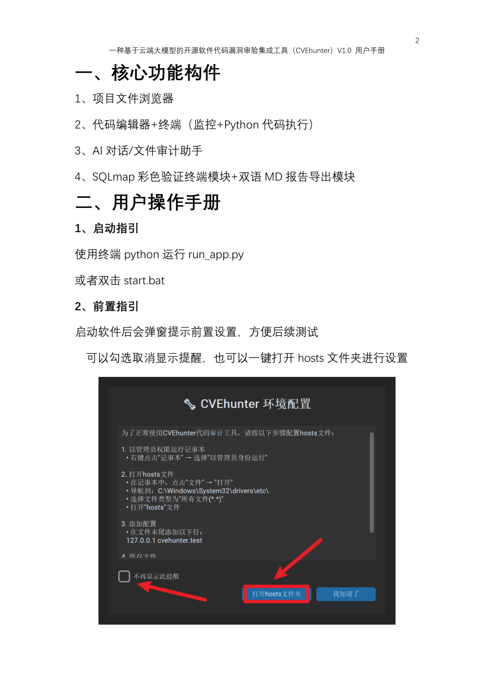

---

需要继续打开弹窗提示的，可以在右上角“设置”-”提示与提醒”打开开关

另外，该软件的所有栏目都可以左右拖拉调整大小。

## 3、打开项目

在左上角，可以点击“打开项目”打开待审计文件夹

打开后按钮旁边会显示文件夹名称，左下角会显示当前文件夹路径

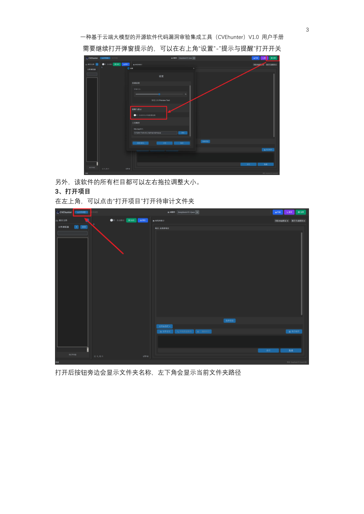

---

## 4、文件新建、编辑与保存、删除

在文件浏览器中左键选中文件即可在代码编辑框中显示。注意只可显示/编辑非二进制文件。
打开“自动换行”开关即可自适应换行，点击“保存”即可保存文件，当前版本，点击“运行”只
可运行python 代码。

点击文件浏览器的两个“+”按钮都可以直接在当前项目文件夹中新建项目文件/文件夹。
新建项目文件注意自己添加文件后缀，以使之具备相应特性

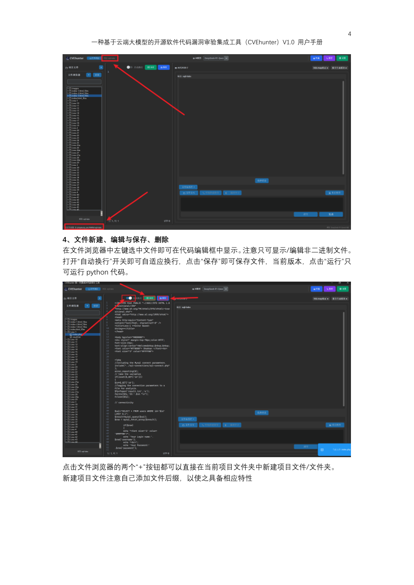

---

当然也可以“右键：在指定位置新建文件/文件夹

文件删除只能在选中后“右键”-“删除”才能完成删除功能

## 6、终端

在默认情况下，终端是不弹出的。只有运行python 代码，才会主动弹出。

由于终端实际具有监控捕获功能，且只在终端弹出时才进行监控，所以可以通过右上角”终
端”按钮主动打开终端。

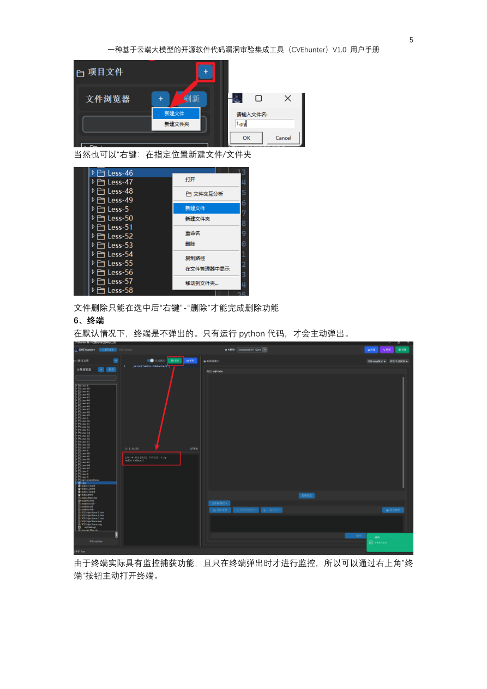

---

## 7、云端大模型管理

添加、管理云端大模型是AI 代码助手模块中最重要的功能前提。在右上角，点击”模型”可
以添加、删除、测试、禁用/启用大模型

大模型调用以云端API key+API 基础文档+官方模型名称为基础构建交流，使用硅基流动的
兼容性最好。
可以点击”添加模型”以添加大模型，底纹显示了填写示例。点击“确定”即可添加。

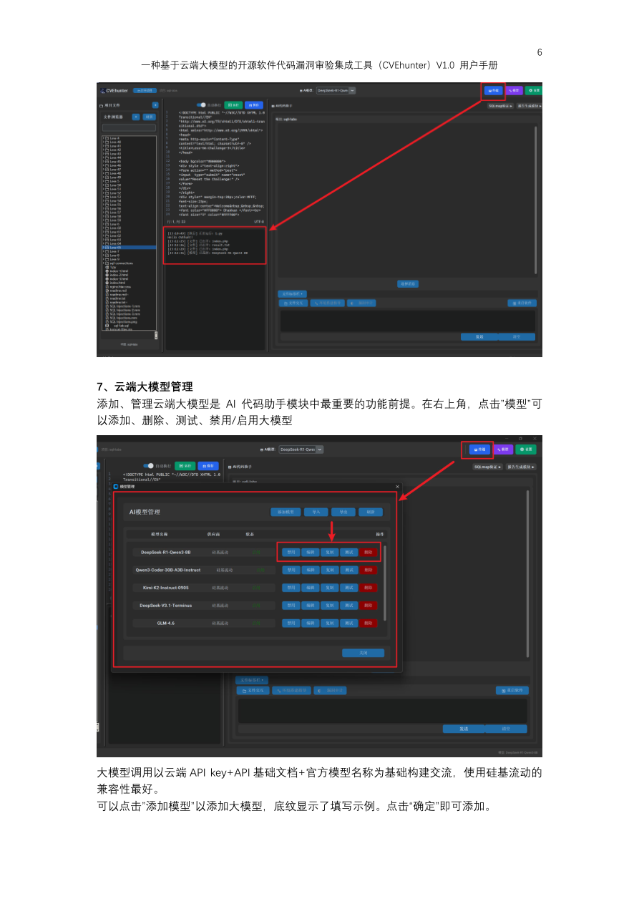

---

为了保护隐私，默认不直接显示key。
点击“测试连接”以测试添加是否成功。

## 8、AI 对话

添加完至少一个大模型后，可以进行基础的AI 对话。
首先，在最上边的AI 模型下拉选择框选择一个已经添加的AI 模型

选定后，直接在对话框发送消息即可。支持Enter 发送消息。
发送过程中有等待动画。耐心即可

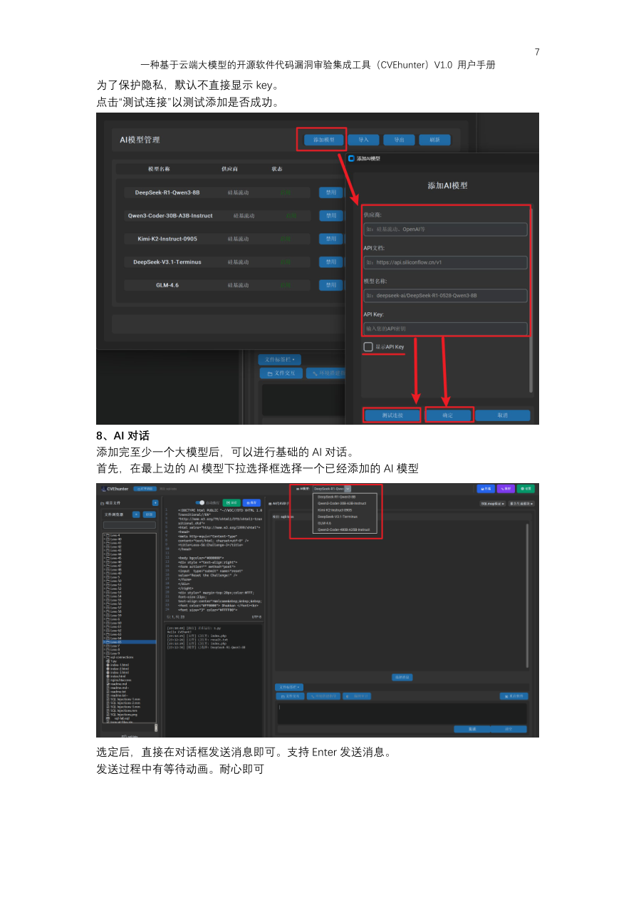

---

在每条消息右上角，有两个按钮。红色代表“删除该条消息”，蓝色代表“复制该条消息”。

如果你想要批量删除消息，点击下方的“选择消息”进行管理。支持勾选与一键全选/取消全
选。删除选中即可。完成删除后，记得手动点击“退出选择”。

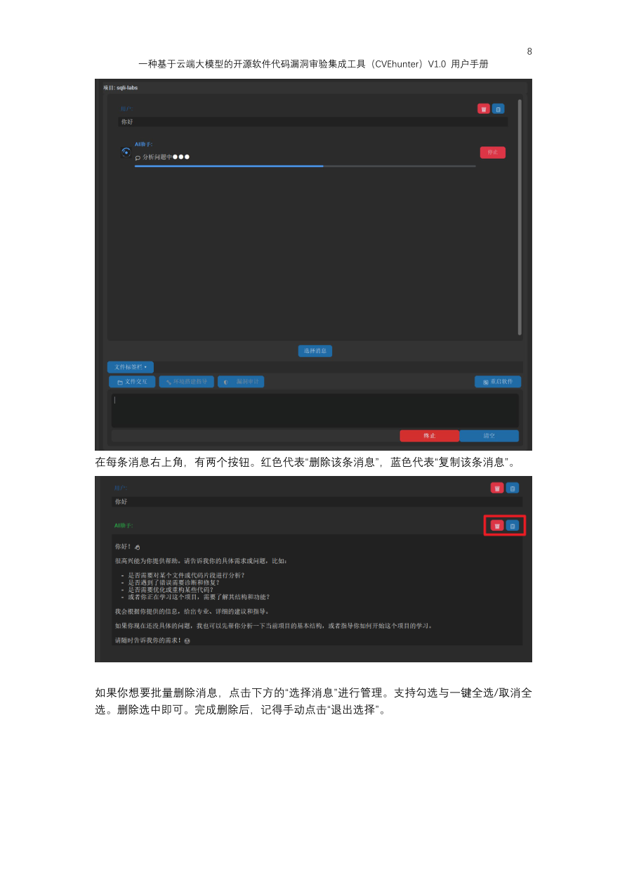

---

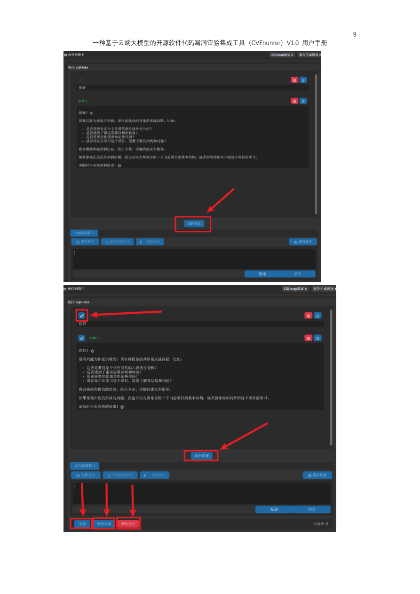

---

## 9、AI 文件交互-创新点

AI 代码审计依赖文件交互模块实现。每次需要传输代码文件时，都必须使用该功能。
文件交互模块主要由文件交互按钮、文件标签栏，以及其余附加功能模块组成。

### 9.1 项目文件夹文件全交互

在未直接指定文件时，直接点击“文件交互”按钮，会默认全选项目文件夹。可以点击“文件
标签栏”查看是否有对应文件夹的文件标签。

此时，可以直接对AI 针对标签指向的文件夹进行提问。AI 会依据项目代码进行回答。

该文件/文件夹的标签可以通过“x”移除。一旦被移除，就会停止对该文件/文件夹的AI 交互。

### 9.2 项目文件夹单/多文件/文件夹交互

可以通过在项目文件浏览器指定文件/文件夹“右键”-“文件交互分析”进行指定文件的交互。

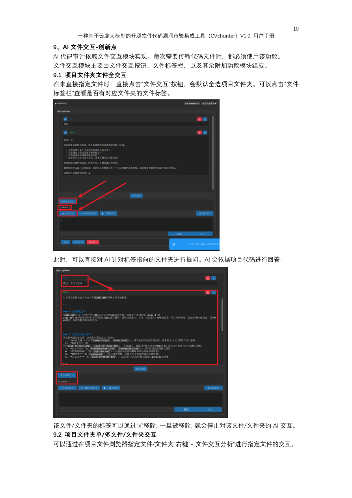

---

其余与9.1 的操作逻辑完全相同。

## 10、AI 环境搭建指导与漏洞审计模块

该部分基于文件交互实现。

### 10.1 AI 环境搭建指导-创新点

选中整个项目文件后，可以点击“环境搭建指导”得到系统在phpstudy 的搭建建议。

### 10.2 AI 漏洞审计

选中整个项目文件/部分文件后，点击“漏洞审计”会展开漏洞选项，当前版本只支持如图四
种漏洞的审计。点击对应按钮即可审计对应漏洞。

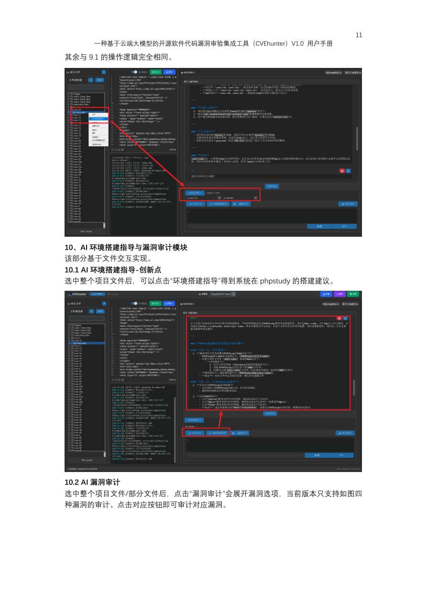

---

## 11、核心-漏洞验证模块-创新点

漏洞验证模块由终端Py 代码执行+SQLmap 复刻终端。可以覆盖几乎所有的漏洞验证。
该部分需要配合系统的AI 输出完成。

### 11.1 示例：SQL 注入验证

按10.2 完成基础流程，得到AI 回复。

关注【12】给出的payload。复制参数行，即为-u 及后所有的内容。
随即在右上角点击“SQLmap 验证”弹出验证终端。填入sqlmap 在本地的路径，以及刚刚复
制的参数内容。点击”开始验证”即可。其余按钮分别支持中断、清空以及终端自动滚动功能。

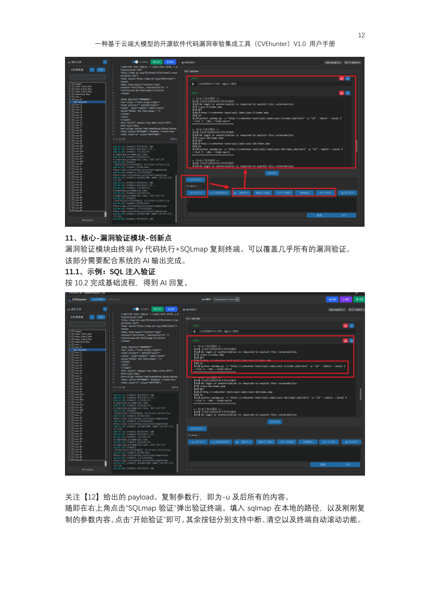

---

如图即可认为验证成功

### 11.2 示例：文件上传/XSS 验证

该部分依赖AI 回复的python PoC 脚本在终端的执行情况。
按照10.2 完成基础流程，得到AI 回复。复制===PY_PoC_START===下给出的PoC，新建
Py 文件进行验证测试。

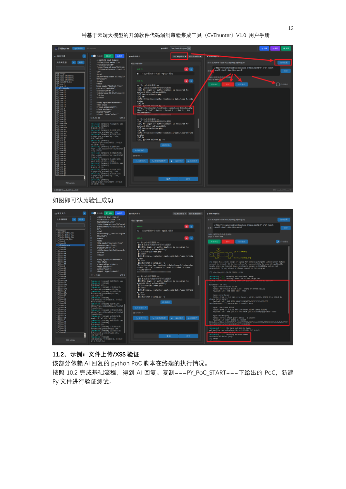

---

如图，成功给出上传路径并成功执行无害whoami 命令即可认为验证成功

## 12、双语MD 报告模块-创新点

完成验证后，需要形成漏洞报告。这里我们以形成中文SQL 注入测试报告为例
在右上角，点击“报告生成模块”，弹出漏洞验证模块栏。
接着点击”模板“，在”中文“选择”SQL 注入“，内置模板即可加载。

接着，在AI 的漏洞审计回复中我们可以看到参杂一些数字。我们一般只需要把数字对应的
信息直接填入框中即可。MD 报告模块支持实时渲染预览，方便修改。

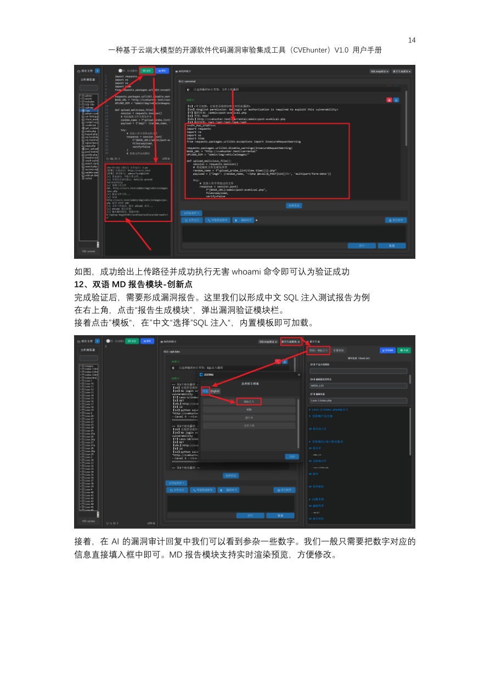

---

当前版本不支持模板自定义。
最后点击右上角”导出MD“即可自定义文件名与位置进行导出了。

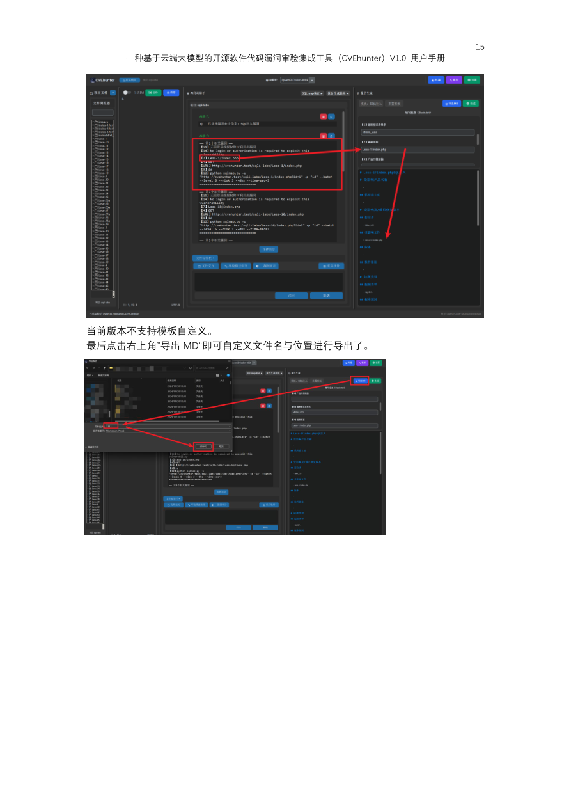
